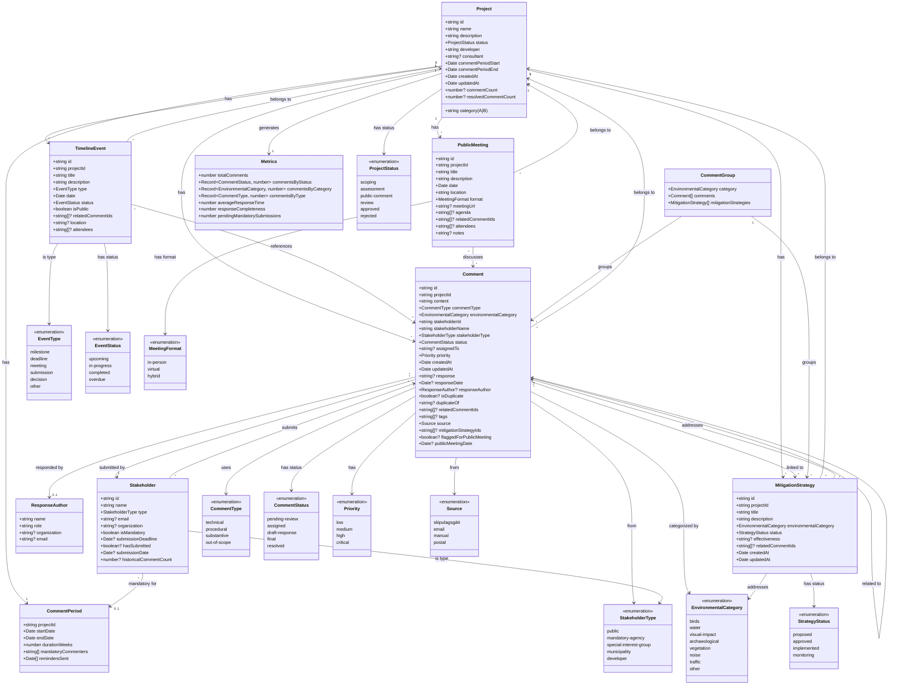

# UML Data Structure Diagram

This document shows the data structure and relationships in the EIA Community Feedback Management system.

## Mermaid Class Diagram



## Relationship Summary

### Core Entities

1. **Project** - Central entity
   - Has many Comments
   - Has many MitigationStrategies
   - Has many TimelineEvents
   - Has many PublicMeetings
   - Has one CommentPeriod
   - Generates one Metrics object

2. **Comment** - Feedback from stakeholders
   - Belongs to one Project
   - Submitted by one Stakeholder
   - Can have one ResponseAuthor
   - Can link to many MitigationStrategies
   - Can relate to other Comments (duplicates/related)

3. **Stakeholder** - Person/organization providing feedback
   - Can submit many Comments
   - Can be mandatory for CommentPeriods

4. **MitigationStrategy** - Actions to address concerns
   - Belongs to one Project
   - Addresses many Comments
   - Grouped by EnvironmentalCategory

5. **TimelineEvent** - Project milestones and deadlines
   - Belongs to one Project
   - Can reference many Comments

6. **PublicMeeting** - Community meetings
   - Belongs to one Project
   - Can discuss many Comments

### Derived/Computed Entities

- **CommentGroup** - Groups comments and strategies by EnvironmentalCategory
- **Metrics** - Calculated statistics for a Project
- **CommentPeriod** - Period definition for comment collection

## Data Flow

```
Project
  ├── Comment (created by Stakeholder)
  │   ├── ResponseAuthor (responds to comment)
  │   └── MitigationStrategy (addresses comment)
  │
  ├── MitigationStrategy
  │   └── Related Comments
  │
  ├── TimelineEvent
  │   └── Related Comments (optional)
  │
  ├── PublicMeeting
  │   └── Related Comments (discussed)
  │
  └── Metrics (computed from Comments)
```

## Storage Structure (LocalStorage)

The prototype stores data in browser localStorage:

- `eia-projects` - Array of Project objects
- `eia-comments` - Array of Comment objects
- `eia-stakeholders` - Array of Stakeholder objects
- `eia-mitigation-strategies` - Array of MitigationStrategy objects
- `eia-timeline-events` - Array of TimelineEvent objects
- `eia-public-meetings` - Array of PublicMeeting objects

## Key Relationships

### One-to-Many
- Project → Comments (1:N)
- Project → MitigationStrategies (1:N)
- Project → TimelineEvents (1:N)
- Project → PublicMeetings (1:N)
- Stakeholder → Comments (1:N)

### Many-to-Many (via arrays)
- Comments ↔ MitigationStrategies (via mitigationStrategyIds)
- Comments ↔ Comments (via relatedCommentIds, duplicates)
- TimelineEvents ↔ Comments (via relatedCommentIds)
- PublicMeetings ↔ Comments (via relatedCommentIds)

### Composition
- Comment contains ResponseAuthor (optional)
- CommentGroup contains Comments and MitigationStrategies
- Metrics derived from Project's Comments

